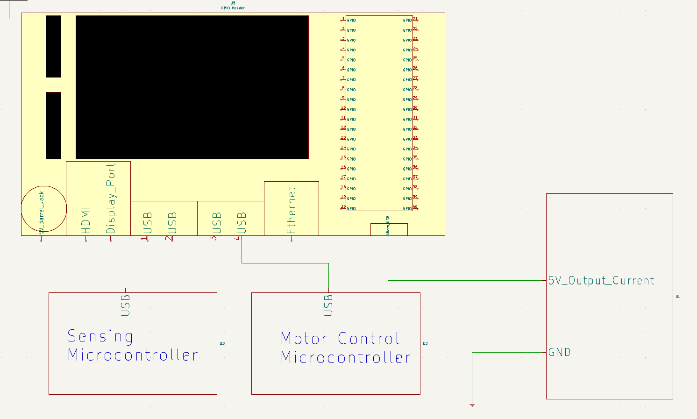

# Master Control Signoff
## Functionality

The Master Control subsystem will facilitate navigation and control of the other
	subsystems to direct the robot around the board. The system will receive 
	inputs from the start button, sensing microcontroller, and other peripherals
	designed by future teams, and it will output instructions to the motor Control
	subsystem and other specified systems (designed by future teams). The subsystem will use a 
	Jetson Nano microcontroller to do all calculations and to send instructions. 
	The system will ultimately perform pathfinding, navigation, and user-defined peripheral tasks,
	but for the scope of the current system, pathfinding and navigation will be addressed 
	and user-defined peripherals will be considered and allotted for future use. 
## Constraints
	
- C2:The robot shall possess an allocated data input point for
	an alternative start method.
	* The master control system will reserve these pins for future users to attach an alternative start method.
	
- C3:The robot shall be autonomous with customizable dimensions and the stock design only occupying up to one-half
	of the allowed cubic foot (1 ft x 1 ft x 6 in) [1]–[3].
	* Autonomy will be achieved by the master controller. All navigation decisions will be made in the master controller. 

- C9:The robot shall travel inclines and declines up to 25 degrees
	* The master controller will send the signal to the motor controller, so it must know when and to what degree any inclines and declines may be. 

- C10:The robot shall turn 360 degrees left and right and move
	forwards and backwards based on sensor inputs.
	* The master controller will send commands to enable movement.

	
- C11: The robot shall have a navigation system that controls
	movement.
	* The master controller will use the data from the sensor inputs to make decisions on the movement outputs. 
	
- C12:The robot shall know its location within a two-inch
	tolerance.
	* The sensor information must be accurately decoded in the master controller to ensure the two-inch tolerance is met. 
	
- C13:The robot shall possess a maximum speed of 2 feet per
	second.
	* The master controller will send speed commands, so it is necessary that the proper speed that is sent should show at the output. 
	
	

## Analysis

The following is a table of the Jetson Nano's pins and adapters:

|Name|Quantity|
|-|-|
|Micros SD slot| 1|
|GPIO pins| 40|
|Micro-USB|1|
|Gigabit ethernet port| 1|
|USB 3.0 Port| 4|
|HDMI output port| 1|
|DC barrel jack| 1|
|MIPI CSI-2 camera connectors| 1|

The Jetson Nano only has a 40-pin expansion header to interface with sensors, peripherals, and 
motors, which does not leave an abundance of extra space. As a result, two of the USB 3.0 ports will be utilized to communicate with
the system microcontrollers. Serial communication will be sent from the sensors to the 
master controller, and then the master controller will make decisions based off of its task and the data. 
Most of the pins will be left for future users to implement tasks. 
	In terms of current, if the DC barrel jack is used, the battery and charging 
Subsystem will need to supply the Jetson Nano with 5V and 4A to properly power the controller. 
However, if the micro-USB is used, the current only needs to reach 2A to properly power the controller. 
Therefore, it is recommended that the micro-USB be used to reduce the current draw on the power system [1]. 

Data Synchronization between multiple microcontrollers will be achieved with the libraries provided on
the Jetson Nano. Commands like stream.synchronize() will achieve the desired synchronization of data streams [2]. 

To have enough storage for any navigation algorithm that is conceivable on the Jetson Nano, a 256GB SD card will be purchased to ensure the 
proper amount of space is available for all applications. In order to interface with the Jetson Nano, a keyboard and mouse will also be needed.

## ROS Implementation and Testing

The robot operating system (ROS) was used in the 2023 SECON robot as the master level controller [3]. 
As such, there is already ample proof that the Jetson Nano can easily connect to microcontrollers. 
Therefore, no simulation is necessary to understand that the Nano will not have compatibility issues controlling other microcontrollers. 

Using ROS and its programs does require the storage to be large enough to house all available code and algorithms, though. Since the Nano is capable of 
housing AI algorithms in tandem with vision systems and complex navigation systems all at once, it is safe to say that the Nano will be more than capable of 
running any simultaneous localization and mapping (SLAM) algorithm and should still have ample space for other user applications. 
Even if future teams use vision systems or neural networks, the Jetson Nano is designed to properly handle nearly any case within the scope of SECON. 

To further ensure that there is enough space, though, a 256GB SD card will be used to provide an abundance of storage. If future teams need to add even more space, a simple
upgrade to the SD card will be an easy adjustment to make. 

### Bill of Materials (BOM)

|Item Name|Sale Location|Quantity|Price/Item|Total Price|
|-|-|-|-|-|
|Jetson Nano|Amazon.com| 1 | $152.00| $152.00|
|256 GB Memory Card| Amazon.com| 1 | $25.00| $25.00|
|Keboard and Mouse Combo| Amazon.com| 1| $15.00 | $15.00|
|Micro-USB cable| Amazon.com| 1| $5.00 | $5.00 |

References:

[1]Jetson Nano basic info: “Amazon.com: Jetson Nano Developer Kit,” Amazon, https://www.amazon.com/Studio-Jetson-Developer-Computer-Development/dp/B09CPYR31L (accessed Oct. 31, 2023). 

[2]Jetson Nano Setup Procedures:  “Get started with Jetson Nano Developer Kit,” NVIDIA Developer, https://developer.nvidia.com/embedded/learn/get-started-jetson-nano-devkit#setup-display (accessed Oct. 30, 2023). 

[3]Previous Team's Github Signoff: Gardner, Nathan (2023) ToplevelController. https://github.com/TnTech-ECE/Spring2023-SECONRobot.

Navigation Algorithms: DFRobot, “Most popular slam open source framework for LIDAR,” DFRobot, https://www.dfrobot.com/blog-1647.html (accessed Oct. 30, 2023). 
