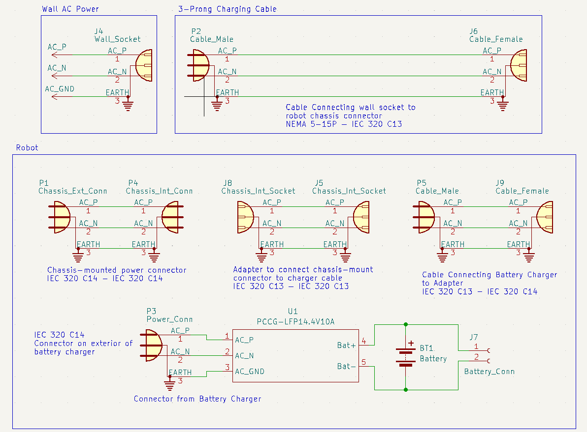

# Battery Management Signoff

## Functionality

The primary function of the battery management system is to provide a system that can supply adequate current to the robot's systems. This battery must be able to be recharged without the removal of the battery and be able to be used while being charged.

## Constraints

### Derived from Shall Statements

- C5: The robot shall possess a robust, centralized charging system that does not require the removal of the battery and that allows the robot to be used while being charged.
	+ This constraint is the most important for this subsystem. This constraint requires that the battery management can provide enough power to the system and allow for the robot to be used while the battery is being charged. Also, that the battery can be charged without removal of the battery. The battery should be able to supply enough energy for the robot to have at least a 30-minute battery life before needing to be recharged.

### Derived from Broader Implications

- C17: The robot shall abide by NEC 310.15(B)(16) when sizing any conductors for the project [1].
	+ This constraint is relevent to this subsystem because it ensures that all of the conductors and connectors used are able to withstand the maximum possible current that may be required by the robot.

## Schematic

Figure 1. Battery Management Schematic.

The schematic above shows the system designed for the battery management subsystem. Starting from the top-left, a standard wall socket is shown. Connected to this is the cable chosen that fits standard wall socket with a NEMA 5-15P connector. The other side of this cable is an IEC 320 C13 (female) connector meant to connect to a standard 3-prong male receptacle. Below the cable, a panel-mount power connector with two IEC 320 C14 (male) connectors is shown. This connector is meant to be mounted to the chassis of the robot with one connector facing the exterior and one facing the interior of the robot. Connected to the interior of the connector is an IEC 320 C13 to C13 (female to female) adapter to allow for a male cable to easily plug into the interior side of the chassis connector. A short cable with one side IEC 320 C14 (male) and one side IEC 320 C13 (female) was then chosen to connect the adapter to the battery charger, which has a male receptacle connector for its power supply.

This provides power from a standard US wall socket to the battery charger. The charging leads of the battery charger are then connected to the + and - terminals on the battery. This charger will charge and regulate the battery, preventing failures and maintaining maximum battery charge [2]. Finally, the battery is connected to the input of the power distribution board, which then distributes power to the rest of the robot.

## Analysis

### C5: Robust Charging System

There are several parts to this constraint, all discussed below. 

#### Battery Capacity

In order to meet this constraint, first the robot must be able to have at least a 30-minute runtime before requiring that the batteries be recharged.

Because this will require a large battery capacity along with stringent mass and volume constraints placed by the battery needing to fit within the chassis of the robot, a high energy-density battery is preferable. Of the standard battery types (lithium, nickel-metal hydride, sealed lead acid, etc.), lithium batteries have the best volumetric energy density (energy/unit volume) and the best gravimetric energy density (energy/unit mass) [3]. For this reason a lithium battery was chosen to be used for the robot.

#### Table 1. Current Requirements [4] [5] [6] [7] [8] [9] [10]
| Item | Part Number | Quantity | Max Current Draw (mA) | Item Current (mA) |
| --- | --- | --- | --- | --- |
| Line Sensor | Pololu QTR-8RC | 1 | 100 | 100 |
| Ultrasonic Distance Sensor | SKU 101020010 | 4 | 8 | 32 |
| Jetson Nano\* | SKU 101020010 | 1 | 2000 | 2000 |
| Compass| LIS3MDL | 1 | 0.27 | 0.27 |
| Accelerometer | ADXL345 | 1 | 0.14 | 0.14 |
| Motor | Metal Gearmotor 37Dx73L mm 12V | 4 | 720 | 2880 |
| Motor Driver | L298N Motor Drive Controller Board | 2 | 2000 | 4000 |
| Total Current |  |  |  | 9012.41 |

\*The Jetson Nano current requirements depend on the supply method chosen. The Micro-USB connection was chosen in this case.

As shown in Table 1 above, the total worst-case current required by all of the components of the base robot is a little over 9 A. In order for the battery to be able to supply enough energy for 30 minutes of continuous runtime, it must then have a capacity of at least 4.5 Amp-Hours (Ah) (9 Amps x 0.5 Hours).

The battery chosen has more capacity than this requirement, having a capacity of 7.2 Ah [11]. This means that a total of 9 A could be pulled from the battery for 48 minutes before the battery needs to be recharged.

Note that the above calculation means that the worst-case current draw can be supplied for 48 minutes. Any future additional current requirements can still potentially be supplied but for a shorter time period. Additionally, the realistic case is a longer battery life as not every component will be pulling the maximum (worst-case) current.

#### Battery Management

As is implied by the name of the signoff, in order for this subsystem to be considered functional the battery must be adequately managed. The chosen battery charger has two leads for connecting to the + and - terminals on the battery [2]. The battery charger supplies current through these leads to the battery for charging, and takes voltage/current measurements to regulate the battery to prevent failures. 

The charger chosen is designed for a battery with a 12.8 V nominal voltage, which the chosen battery has, and will charge the battery until fully charged, at which point the charger will cease supplying current [2].

By taking voltage and current measurements continuously, the battery charger has protection against short circuits, overcharging, undercharging, and reverse polarity [2]. Additionally, the charger has LEDs that indicate the current state of the battery (fully charged, charging, etc.).

Additionally, current can be pulled directly from the battery charger if needed. This will be used if the robot is running directly off of power from a wall socekt. The current capabilities of the battery charger are discussed more below.

This data provided by the manufacturer gives the best guarentee that the battery management system will be able to adequately and safely manage the battery that powers the entire robot.

#### Current Sourcing

The battery itself must be able to source the worst-case current without damage. The battery chosen is able to supply up to 15 A, much more than the nominal worst-case system current of about 9 A given in Table 1 [11].

It is preferable that the robot have the ability to be run using only the power from the wall socket. Since all power to the robot is routed through the battery charger, whether it is used for charging or not, the battery charger must be able to source the worst-case current drawn by robot by itself. Using the same worst-case current number calculated in Table 1 of 9 A, the battery charger chosen can source more than the worst-case figure, up to 10 A [2].

Note that if future teams require that a robot with higher current requirements can be run directly off wall-socket power, then the battery charger may need to be replaced with higher-current capacity alternatives. The suggested alternative is the PCCG-LFP14.4V15A charger, a nearly identical charger made by the same manufacturer but with a higher maximum output current of 15 A [12].

#### Charging without Battery Removal

Another requirement of this constraint is that the battery be chargeable without being removed. The design for this is shown in the schematic Figure 1. To provide charging capability without battery removal the following system was designed. 

A panel-mount connector was chosen that could be mounted onto the chassis with screws. This connector has an IEC 320 C14 (male) connector on both sides for connecting cables to both the interior and exterior of the robot [13]. For connecting to this on the interior side of the chassis, an IEC 320 C13 - IEC 320 C13 adapter (female to female) was used to match the cable connected to the battery charger [14]. This is needed because the battery charger and chassis connectors both have male connectors, which without the adapter would require a female-female IEC 320 cable, which are difficult to find.

For connecting to the exterior side of the chassis connector another cable was chosen with one side IEC 320 C13 and one side NEMA 5-15P connector [15]. The IEC connector side will fit the chassis connector, and the NEMA connector side will fit a standard US wall socket. All of these cables and connectors together allow for direct sourcing of power from a standard US wall socket.

These components work together to allow for easy charging of the battery with a standard 3-prong cable without removal.

### C17: Current Capacities

All components involved in the battery management and charging must be able to handle the worst case current with some buffer for extra safety. While the worst-case current for the robot is about 9 A, all power is routed through the battery charger. This means that the battery charger must be able to source enough current, (discussed earlier) and the conductors before the charger must be able to supply the input current required by the charger.

From the datasheet of the battery charger, the charger requires an input current of 2.5 A [2]. This means that the conductors and connectors before the charger must be able to supply more than this current.

All of the conductors and connectors chosen can sustain much more than 2.5 A without damage [13][14][15][16]. All of the components chosen for supplying current to the battery charger (wall cable, connector, adapter, and charger cable) can supply up to 10 A of current, far more than the required 2.5 A. These components are all within the requirements given by NEC 310.15(B)(16), and can adequately sustain much more than the current required without failure [1].

## BOM 

| Item | Part Number | Quantity | Price/Unit | Item Price |
| --- | --- | --- | --- | --- |
| Lithium Iron Phosphate Battery | PSL-SC-1270 F2 | 1 | $91.43 | $91.43 |
| Lithium Iron Phosphate Battery Charger | PCCG-LFP14.4V10A | 1 | $129.27  | $129.27 |
| Panel Mount 3-Prong Receptacle | 6100.33 | 5 | $1.15 | $5.75 |
| 12 Foot 3-Prong AC Power Cable | P010-012 | 2 | $10.62 | $21.24 |
| IEC 320 C13 - C14 Power Cable | AK500-OE-11-.5 | 1 | $3.67 | $3.67 |
| C13 - C13 Adapter | C13 to C13 Power adapter | 1 | $14.99 | $14.99 |
| Total |  |  |  | $266.35 |

## References

[1] “Using the National Electrical Code® (NEC ®) Ampacity Charts,” May
2021. [Online]. Available: https://www.nfpa.org/∼/media/Files/Code%
20or%20topic%20fact%20sheets/NECAmpacityWorkflow.pdf

[2] “PCCG-LFP14.4V10A 14.4V 10A Lithium Iron Phosphate (LiFePO4) Battery Charger.” Zeus Battery Products. Accessed: Nov. 09, 2023. [Online]. Available: https://www.zeusbatteryproducts.com/wp-content/uploads/downloads/ZEUS_LiFePO_CHARGER_PCCG-LFP%2014.4V10A_SPEC_SHEET_REVV2.2.pdf

[3] “Battery Types and Principles | AE 868: Commercial Solar Electric Systems.” Accessed: Nov. 06, 2023. [Online]. Available: https://www.e-education.psu.edu/ae868/node/895

[4] “Pololu - QTR-8RC Reflectance Sensor Array.” Accessed: Oct. 22, 2023. [Online]. Available: https://www.pololu.com/product/961

[5] “Grove - Ultrasonic Distance Sensor.” Accessed: Oct. 20, 2023. [Online]. Available: https://www.seeedstudio.com/Grove-Ultrasonic-Distance-Sensor.html

[6] “Jetson Nano Datasheet.” Nvidia, 2014. Accessed: Oct. 18, 2023. [Online]. Available: https://developer.download.nvidia.com/assets/embedded/secure/jetson/Nano/docs/JetsonNano_DataSheet_DS09366001v1.1.pdf?e_BpiWXSa7FdCNNMUERS1XuHOk9lwmKijVR7Lqo5nsTQqOnZohl7_A4Zg9ZMz9lxl6D-4aex58LQB2d3OlEs-g7Mu5a02EXZxYgwU_7Vtu-b9tGgiqLPXcAONdN0IpmmVgJYJRYoL63dp5wIb7uvGYchxxc5bLfxdyYFNBUTIuZ3y5ZG-9z4YzOx-w6xrg==

[7] “LIS3MDL - Digital output magnetic sensor : ultra-low-power, high-performance 3-axis magnetometer - STMicroelectronics.” STMicroelectronics, May 2017. Accessed: Oct. 20, 2023. [Online]. Available: https://www.st.com/en/mems-and-sensors/lis3mdl.html

[8] “ADXL345 Datasheet and Product Info | Analog Devices.” Analog Devices. Accessed: Oct. 16, 2023. [Online]. Available: https://www.analog.com/en/products/adxl345.html

[9] “Pololu - 150:1 Metal Gearmotor 37Dx73L mm 12V with 64 CPR Encoder (Helical Pinion),” Polulu. Accessed: Oct. 16, 2023. [Online]. Available: https://www.pololu.com/product/2828/specs

[10] “Dual full-bridge driver.” STMicroelectronics. [Online]. Available: https://www.sparkfun.com/datasheets/Robotics/L298_H_Bridge.pdf

[11] “PSL-SC-1270 12.8V 7.2 AH Rechargeable Lithium Battery.” Power Sonic, 2019. Accessed: Nov. 09, 2023. [Online]. Available: https://www.power-sonic.com/wp-content/uploads/2020/04/PSL-SC-1270-technical-specifications.pdf

[12] “PCCG-LFP14.4V15A 14.4V 15A Lithium Iron Phosphate (LiFePO4) Battery Charger.” Zeus Battery Products. Accessed: Nov. 09, 2023. [Online]. Available: https://www.zeusbatteryproducts.com/wp-content/uploads/downloads/ZEUS_LiFePO_CHARGER_PCCG-LFP14.4V15A_SPEC_SHEET_REVV2.2.pdf

[15] “p010012.pdf.” Tripp Lite. [Online]. Available: https://assets.tripplite.com/product-pdfs/en/p010012.pdf

[13] “6100-3 - Connectors (Inlets/Outlets).” Shurter. [Online]. Available: https://www.schurter.com/en/datasheet/typ_6100-3.pdf

[14] “(2 Pack)C13 to C13 Power adapter, IEC 320 C13 Female to C13 Female Power Plug Adapter Extension Extender Travel Converter - Newegg.com,” Newegg. Accessed: Nov. 07, 2023. [Online]. Available: https://www.newegg.com/p/2VH-0003-00029

[16] “AK500-OE-11-.5,” Digi-Key Electronics. Accessed: Nov. 07, 2023. [Online]. Available: https://www.digikey.com/en/products/detail/assmann-wsw-components/AK500-OE-11-5/821664
