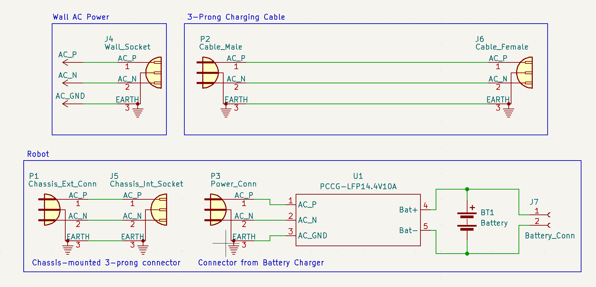

# Battery Management Signoff

## Functionality

The primary function of the battery management system is to provide a system that can supply adequate current to the robot's systems. This battery must be able to be recharged without the removal of the battery and be able to be used while being charged.

## Constraints

### Derived from Shall Statements

- C5: The robot shall possess a robust, centralized charging system that does not require the removal of the battery and that allows the robot to be used while being charged.
	+ This constraint is the most important for this subsystem. This constraint requires that the battery management can provide enough power to the system and allow for the robot to be used while the battery is being charged. The battery should be able to supply enough energy for the robot to have a 2-hour battery life before needing to be recharged.

### Derived from Broader Implications

- C17: The robot shall abide by NEC 310.15(B)(16) when sizing any conductors for the project.
	+ This constraint is relevent to this subsystem because it ensures that all of the conductors and connectors used are able to withstand the maximum possible current that may be required by the robot.

## Schematic

##### Explain schematic ----------------------------

## Analysis

### Robust Charging System

There are several parts to this constraint, all discussed below. 

In order to meet this constraint, first the robot must be able to have a 2-hour runtime before requiring that the batteries be recharged.

Because this will require a large capacity along with stringent mass and volume constraints placed by the battery needing to fit within the chassis of the robot, a high energy-density battery is preferable. Of the standard battery types, lithium batteries have the best volumetric energy density (energy/unit volume) and the best gravimetric energy density (energy/unit mass) [types].

#### Table 1. Current Requirements [QTR] [Grove] [Jetson] [LIS3MDL] [ADXL345] [150:1] [Dual]
| Item | Part Number | Quantity | Max Current Draw (mA) | Item Current (mA) |
| --- | --- | --- | --- | --- |
| Line Sensor | Pololu QTR-8RC | 1 | 100 | 100 |
| Ultrasonic Distance Sensor | SKU 101020010 | 4 | 8 | 32 |
| Jetson Nano\* | SKU 101020010 | 1 | 2000 | 2000 |
| Compass| LIS3MDL | 1 | 0.27 | 0.27 |
| Accelerometer | ADXL345 | 1 | 0.14 | 0.14 |
| Motor | Metal Gearmotor 37Dx73L mm 12V | 4 | 720 | 2880 |
| Motor Driver | L298N Motor Drive Controller Board | 2 | 2000 | 4000 |
| Total Current |  |  |  | 9012.41 |

\*The Jetson Nano current requirements depend on the supply method chosen. The Micro-USB connection was chosen in this case.

As shown in Table 1 above, the total worst-case current required by all of the components of the base robot is a little over 9 A. In order for the battery to be able to supply enough energy for 2 hours of continuous playtime, it must then have a capacity of at least 18 Amp-Hours.

The battery chosen has more capacity than the requirement, having a capacity of 20 Ah [Battery]. This means that a total of 10 A could be pulled from the battery for 2 full hours before the battery needs to be recharged.

Note that the above calculation means that the worst-case current draw can be supplied for 2 hours. Any future additional current requirements can still potentially be supplied but for a shorter time period.

Additionally, the battery itself must be able to source the worst-case current without damage. The battery chosen is able to supply up to 20 A, much more than double the nominal worst-case current of about 9 A [Battery].

It is preferable that the robot be able to be run using only the power from the wall socket. Since all power to the robot is routed through the battery charger, whether it is used for charging or not, the battery charger must be able to source the worst-case current draw of the robot by itself. Using the same worst-case current number calculated above of 9 A, the battery charger chosen can source more than the worst-case figure, up to 10 A [charger].

Note that if future teams require that a robot with higher current requirements can be run directly off wall-socket power, then the battery charger may need to be replaced with higher-current capacity alternatives. The suggested alternative is the PCCG-LFP14.4V15A charger, a nearly identical charger but with a higher maximum output current [charger15a].

### Current Capacities

All components involved in the battery management and charging must be able to handle the worst case current with some buffer for extra safety. While the worst-case current for the robot is about 9 A, all power is routed through the battery charger. This means that the battery charger must be able to source enough current, and the conductors before the charger must only be able to supply the input current required of the charger.

From the datasheet of the battery charger, the charger requires an input current of 2.5 A [charger]. This means that the conductors and connectors before the charger must be able to supply more than this current.

All of the conductors and connectors chosen can sustain much more than 2.5 A without damage [pwr_cable][chassis_conn][adapter][chrg_cable]. All of the components chosen for supplying current to the battery charger can supply up to 10 A of current, far more than the required 2.5 A.

## BOM 

| Item | Part Number | Quantity | Price/Unit | Item Price |
| --- | --- | --- | --- | --- |
| Lithium Iron Phosphate Battery | LITHIUM 12.8V20AH | 1 | $121.00 | $121.00 |
| Lithium Iron Phosphate Battery Charger | PCCG-LFP14.4V10A | 1 | $129.27  | $129.27 |
| Panel Mount 3-Prong Receptacle | 6100.33 | 5 | $1.15 | $5.75 |
| 12 Foot 3-Prong AC Power Cable | P010-012 | 2 | $10.62 | $21.24 |
| IEC 320 C13 - C14 Power Cable | AK500-OE-11-.5 | 1 | $3.67 | $3.67 |
| C13 - C13 Adapter | C13 to C13 Power adapter | 1 | $14.99 | $14.99 |
| Total |  |  |  | $295.92 |

## References

[nfpa] “Using the National Electrical Code® (NEC ®) Ampacity Charts,” May
2021. [Online]. Available: https://www.nfpa.org/∼/media/Files/Code%
20or%20topic%20fact%20sheets/NECAmpacityWorkflow.pdf

[types] “Battery Types and Principles | AE 868: Commercial Solar Electric Systems.” Accessed: Nov. 06, 2023. [Online]. Available: https://www.e-education.psu.edu/ae868/node/895

[QTR] “Pololu - QTR-8RC Reflectance Sensor Array.” Accessed: Oct. 22, 2023. [Online]. Available: https://www.pololu.com/product/961

[Grove] “Grove - Ultrasonic Distance Sensor.” Accessed: Oct. 20, 2023. [Online]. Available: https://www.seeedstudio.com/Grove-Ultrasonic-Distance-Sensor.html

[Jetson] “Jetson Nano Datasheet.” Nvidia, 2014. Accessed: Oct. 18, 2023. [Online]. Available: https://developer.download.nvidia.com/assets/embedded/secure/jetson/Nano/docs/JetsonNano_DataSheet_DS09366001v1.1.pdf?e_BpiWXSa7FdCNNMUERS1XuHOk9lwmKijVR7Lqo5nsTQqOnZohl7_A4Zg9ZMz9lxl6D-4aex58LQB2d3OlEs-g7Mu5a02EXZxYgwU_7Vtu-b9tGgiqLPXcAONdN0IpmmVgJYJRYoL63dp5wIb7uvGYchxxc5bLfxdyYFNBUTIuZ3y5ZG-9z4YzOx-w6xrg==

[LIS3MDL] “LIS3MDL - Digital output magnetic sensor : ultra-low-power, high-performance 3-axis magnetometer - STMicroelectronics.” STMicroelectronics, May 2017. Accessed: Oct. 20, 2023. [Online]. Available: https://www.st.com/en/mems-and-sensors/lis3mdl.html

[ADXL345] “ADXL345 Datasheet and Product Info | Analog Devices.” Analog Devices. Accessed: Oct. 16, 2023. [Online]. Available: https://www.analog.com/en/products/adxl345.html

[150:1] “Pololu - 150:1 Metal Gearmotor 37Dx73L mm 12V with 64 CPR Encoder (Helical Pinion),” Polulu. Accessed: Oct. 16, 2023. [Online]. Available: https://www.pololu.com/product/2828/specs

[Dual] “Dual full-bridge driver.” STMicroelectronics. [Online]. Available: https://www.sparkfun.com/datasheets/Robotics/L298_H_Bridge.pdf

[pwr_cable] “p010012.pdf.” Tripp Lite. [Online]. Available: https://assets.tripplite.com/product-pdfs/en/p010012.pdf

[chassis_conn] “6100-3 - Connectors (Inlets/Outlets).” Shurter. [Online]. Available: https://www.schurter.com/en/datasheet/typ_6100-3.pdf

[adapter] “(2 Pack)C13 to C13 Power adapter, IEC 320 C13 Female to C13 Female Power Plug Adapter Extension Extender Travel Converter - Newegg.com,” Newegg. Accessed: Nov. 07, 2023. [Online]. Available: https://www.newegg.com/p/2VH-0003-00029

[chrg_cable] “AK500-OE-11-.5,” Digi-Key Electronics. Accessed: Nov. 07, 2023. [Online]. Available: https://www.digikey.com/en/products/detail/assmann-wsw-components/AK500-OE-11-5/821664
