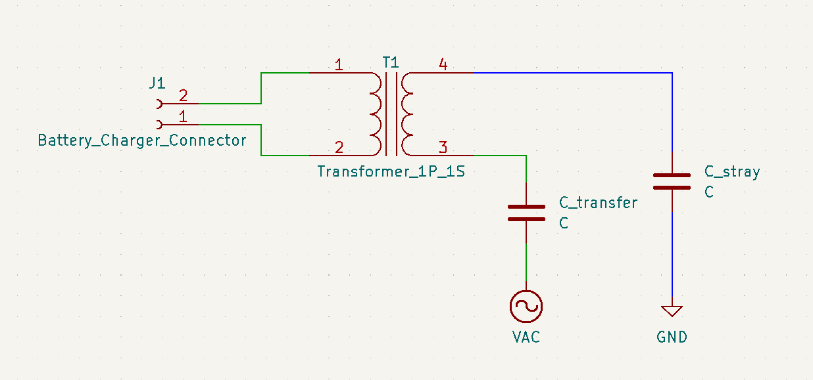

# Wireless Charging Signoff

## Functionality

The wireless charging subsystem will be more experimental than the other subsystems. The primary functionality of this subsystem is to supply power wirelessly to the robot over the entire arena area so that the battery can be charged during use and testing. This will be done using capacitive wireless charging, as it has the most potential to allow for wireless power transfer over the largest area.

## Constraints

### Derived from Shall Statements

- C6: Wireless charging shall be evaluated as an option for
charging the robot.
	+ This constraint was made at the request of the customer. This constraint requires that wireless charging be investigated as best as possible as a method of charging the robot wirelessly while the robot being used is in the game arena. The goal for this constraint is that the robot be able to be charged over as much of the entire 4 ft x 8 ft arena area as possible [1][2][3].

### Derived from Broader Implications

- C15: The robot shall not use radiative wireless power transfer
technology.
	+ This constraint rules out radiative wireless power transfer methods for wireless charging. Radiative wireless power transfer has a higher potential for personal harm than nonradiative and so has stricter regulations. Radiadive wireless power can only be safely used for power consumption under 10 milliwatts, much less than the robot requirements, making radiative power transfer too dangerous of an option to pursue [4][5].

- C16: The robot shall abide by the applicable FCC regulations
regarding wireless charging methods outlined in parts 15
and 18 of the standard.
	+ This constraint requires that the wireless charging methods investigated and used comply with all FCC regulations for wireless power transfer in order to minimize risk of personal harm [4].

## Schematic

This schematic is a simplified version of the schematic presented by Van Neste et al. in “Quasi-wireless capacitive energy transfer for the dynamic charging of personal mobility vehicles” and “Quasi-wireless surface power and control for battery-free robotics” [6][7]. 

In this setup, known as unipolar capacitive wireless power transfer, a metal plane is excited by a high-frequency function generator [6][7]. This capacitively couples to a metal plane on the robot, represented by C_transfer. This plane on the robot is put in series with the primary inductor of a transformer to step up/down the voltage to whatever voltage is needed by the charger on the secondary side. The other side of the primary inductor of the transformer has a stray capacitance that capacitively couples to the ground of the function generator, represented by C_stray on the schematic.

## Analysis

As mentioned above, this subsystem will be very experimental. Because of this, the analysis for this subsystem will consist mostly of reviewing existing literature on wireless power transfer and citing work already done for the subsystem design.

### Wireless Charging Evaluation

The two main technologies for wireless power transfer are inductive and capacitive transfer [5]. Both technologies have strengths and weaknesses that were evaluated for this subsystem. Inductive power transfer (IPT) utilizes two inductors to inductively couple to each other and transfer power from transmitter to receiver. IPT is more researched and widely used, but has a very short range as the transmitter and receiver become unaligned. Capacitive power transfer (CPT) uses capacitors to couple between transmitter and receiver, where one conductor is the transmitter and one is the receiver, forming a capacitive connection between the two. Two of these types of capacitors are required for a full current path. CPT also has a very short range, but large conductive sheets can be used for the transmitting half of the capacitor, allowing for a large surface area over which a device can wirelessly receive power [6][7].

It is for these reasons that capacitive power transfer was chosen to be explored in this subsystem. The goal is that the entire 4 ft x 8 ft area of the arena can have a conductive sheet underneath, allowing for wireless charging over the entire arena area [1]-[3].

The subsystem design is based primarily on the work done by Van Neste, a faculty member at TnTech, et al. in “Quasi-wireless capacitive energy transfer for the dynamic charging of personal mobility vehicles” and “Quasi-wireless surface power and control for battery-free robotics” [6][7]. This is because the applications of their technology are very close to our applications. In the first paper, the group uses CPT to have a large area over which a personal mobility vehicle can be charged, very similar to this subsystem [6].

In the personal mobility vehicle paper, the research group uses large sheets of aluminum foil for the large conductive planes used as capacitive transmitter and receiver [6]. This transmitting conductive sheet on the ground is excited by a function generator at several MHz and amplified by a high-powered RF amplifier. Aluminum foil will be purchased for this subsystem and function generators are readily available at TnTech facilities as well as the RF amplifiers used in this paper, which can be accessed through collaboration with Dr. Van Neste and his research group. In the future, designing an amplifier system may be investigated.

### Not Using Radiative Wireless Power Transfer

The wireless power transfer used in this subsystem uses capacitive power transfer and uses no radiative power transfer methods or technologies [5][6]. This fulfills this constraint.

### Abiding by FCC Regulations

One of the primary differences between Dr. Van Neste's work and other CPT research is the use of unipolar power transfer as opposed to bipolar power transfer [6][7]. Unipolar CPT utilizes one major capacitor for the power transfer to the 

## BOM

| Item | Part Number | Quantity | Price/Unit | Item Price |
| --- | --- | --- | --- | --- |
| Aluminum Foil | Amazon Basics Aluminum Foil, 250 Sq Ft | 1 | $13.49 | $13.49 |
| Magnet Wire | 610222 | 1 | $120.57 | $120.57 |

## References

[1] “IEEE SOUTHEASTCON 2024 STUDENT HARDWARE COMPETITION RULES Version 5.6,”Sep.2023. [Online]. Available: https://ieeesoutheastcon.org/wp-content/uploads/sites/497/SEC24-HW-Competition_V5.6-1.pdf

[2] “IEEE SoutheastCon 2023 Hardware Competition Rules,” Oct. 2022. [Online]. Available: https://github.com/lchapman42/Control-Sensing-Wireless-Charging-Robot/blob/main/Documentation/Background%20Documents/IEEE%20SoutheastCon%202023%20Hardware%20Competition%20Rules%20v3.0.pdf

[3] “IEEE SoutheastCon 2022 Hardware Competition Rules,” Mar. 2021. [Online]. Available: https://github.com/lchapman42/ Control-Sensing-Wireless-Charging-Robot/tree/main/Documentation

[4] “RF EXPOSURE CONSIDERATIONS FOR LOW POWER CONSUMER WIRELESS POWER TRANSFER APPLICATIONS,” Jan. 2021. [Online]. Available: https://apps.fcc.gov/kdb/GetAttachment.html?id=g5f2nQFxHnlMbja%2FFzq1QQ%3D%3D&desc=680106%20D01%20RF%20Exposure%20Wireless%20Charging%20Apps%20v03r01&tracking_number=41701

[5] X. Lu, P. Wang, D. Niyato, D. I. Kim, and Z. Han, “Wireless Charging
Technologies: Fundamentals, Standards, and Network Applications,”
IEEE Communications Surveys & Tutorials, vol. 18, no. 2, pp. 1413–
1452, 2016. [Online]. Available: https://ieeexplore.ieee.org/document/7327131

[6] C. W. Van Neste, A. Phani, R. Hull, J. E. Hawk, and T. Thundat, “Quasi-wireless capacitive energy transfer for the dynamic charging of personal mobility vehicles,” in 2016 IEEE PELS Workshop on Emerging Technologies: Wireless Power Transfer (WoW), Knoxville, TN, USA: IEEE, Oct. 2016, pp. 196–199. doi: 10.1109/WoW.2016.7772091.

[7] A. K. Pickering, R. Hull, J. E. Hawk, A. Phani, C. W. Van Neste, and T. Thundat, “Quasi-wireless surface power and control for battery-free robotics,” Wirel Pow Transfer, vol. 2, no. 2, pp. 134–142, Sep. 2015, doi: 10.1017/wpt.2015.15.

[8] “MW-28C Datasheet.” CNC Tech, Nov. 18, 2016. Accessed: Nov. 27, 2023. [Online]. Available: https://mm.digikey.com/Volume0/opasdata/d220001/medias/docus/1066/MW-28C_Spec.pdf